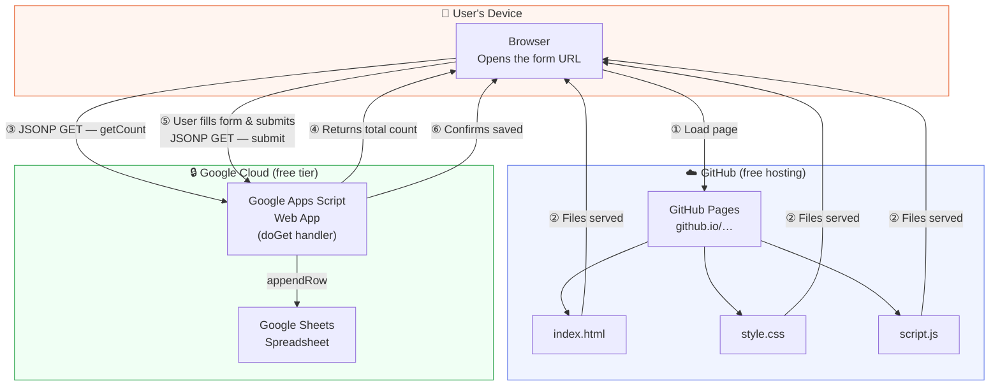

# 💛 Spread Kindness

A simple web app where anyone with the link can share an act of kindness they performed or witnessed.
Submissions save to a Google Sheet you own. Built with plain HTML, CSS, and JavaScript — no frameworks, no server.

**Live site:** https://sahasrarayarao.github.io/Project-SpreadKindness/

<div align="center">
  
  <br><em>Scan to share a kindness act</em>
</div>

---

## What it does

- Anyone with the link can submit a kindness act
- Works for **self-reporting** ("I did something kind") or **reporting someone else** (reporter can stay anonymous)
- Always captures the name of the person who did the kind act
- Shows a live count of all acts shared so far
- All data saves instantly to a Google Sheet you own

---

## Google Sheet columns

| # | Timestamp | Kind Person's Name | Act of Kindness | Reported By | Reporting Type |
|---|-----------|-------------------|-----------------|-------------|----------------|
| 1 | 2024-01-15 10:30:00 | Priya Sharma | Helped carry groceries for an elderly neighbor | Priya Sharma | Self |
| 2 | 2024-01-15 11:45:00 | Ravi Kumar | Left an encouraging note on a coworker's desk | Anonymous | On Behalf Of |

---

## Setup (~10 minutes, one time)

### Step 1 — Create a Google Sheet

Go to [sheets.google.com](https://sheets.google.com), create a blank sheet, and leave it empty.
The script will add the header row automatically on first use.

### Step 2 — Add the Apps Script backend

1. In your Google Sheet → **Extensions → Apps Script**
2. Delete any existing code
3. Copy everything from `apps-script.js` in this repo and paste it in
4. Save with **Ctrl + S**

### Step 3 — Deploy as a Web App

1. Click **Deploy → New Deployment**
2. Click the gear icon → select **Web app**
3. **Execute as:** Me
4. **Who has access:** Anyone
5. Click **Deploy** and copy the URL shown
   (looks like `https://script.google.com/macros/s/ABC.../exec`)

### Step 4 — Connect the URL to the web page

Open `script.js` and replace line 2:

```js
const APPS_SCRIPT_URL = 'https://script.google.com/macros/s/YOUR_ID/exec';
```

Commit and push that change.

### Step 5 — Enable GitHub Pages

**Repo → Settings → Pages → Source: main branch, / (root) → Save**

Your form will be live at `https://<username>.github.io/Project-SpreadKindness/`

---

## Files

| File | Purpose |
|------|---------|
| `index.html` | The form page |
| `style.css` | All visual styling |
| `script.js` | Form logic and Google Sheets communication |
| `apps-script.js` | Paste this into Google Apps Script |

---

## Tech stack

- **Frontend:** HTML5, CSS3, Vanilla JavaScript
- **Backend:** Google Apps Script (serverless, free)
- **Database:** Google Sheets
- **Hosting:** GitHub Pages (free)

---

## Architecture



### What each piece does

| Component | Role | Technology |
|-----------|------|-----------|
| **GitHub Pages** | Hosts and serves the static files — free, no server | GitHub |
| **index.html** | The form UI with two-step flow | HTML5 |
| **style.css** | All styling — warm gradient design, responsive | CSS3 |
| **script.js** | Form logic, JSONP requests, optimistic UI updates | Vanilla JS |
| **Google Apps Script** | Serverless function that receives submissions and writes to the Sheet | Google Apps Script |
| **Google Sheets** | Stores every kindness submission with timestamp | Google Sheets API |

### Request flow

1. User visits the GitHub Pages URL → browser downloads the 3 static files
2. `script.js` fires a `getCount` request via **JSONP** to Google Apps Script to show the live total
3. User fills the form (chooses self / someone else, enters name + description)
4. On submit, `script.js` fires a `submit` JSONP request with the form data
5. Google Apps Script appends a new row to the Sheet and returns the updated count
6. The page shows the success screen immediately (optimistic UI) and updates the count in the background

### Why JSONP instead of fetch?

Google Apps Script web apps don't support CORS headers on `GET` responses, which means a regular `fetch()` call would be blocked by the browser. **JSONP** works around this by loading the response as a `<script>` tag — `<script>` tags are not subject to the same-origin policy, so the response executes directly in the page.
